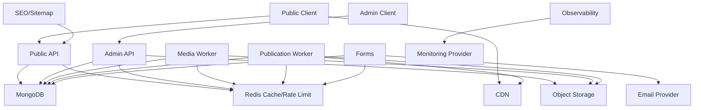

# ANM-WEB-105 Service Dependency Map

Critical dependencies: MongoDB, API runtime, public storage/CDN for public media, deployment/runtime configuration, and security controls.

Degradable dependencies: analytics provider, email delivery, optional CDN invalidation, SEO indexing.

Cascading risks: database outage impacts API/admin/publication; Redis outage impacts workers/queues/rate limits; storage/CDN outage impacts public media and publication; monitoring outage reduces detection but must not expose private data.
